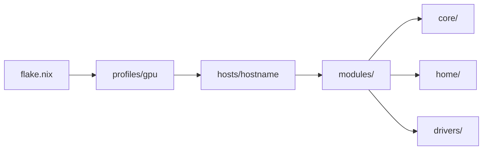

<div align="center">

# NixOS Dotfiles

**Modular, declarative NixOS configuration with multi-GPU support and
self-hosted infrastructure**

[](https://nixos.org)
[](https://nixos.wiki/wiki/Flakes)
[](https://kde.org/plasma-desktop/)
[](https://catppuccin.com)


</div>

---

## Highlights

| Feature          | Description                                                  |
| ---------------- | ------------------------------------------------------------ |
| **Multi-GPU**    | Auto-detect AMD, Intel, NVIDIA, and hybrid configurations    |
| **Device Types** | Laptop/desktop (KDE Plasma) or server (CLI-only) profiles    |
| **Self-Hosted**  | Vaultwarden, Joplin, Headscale, Harmonia binary cache        |
| **One Command**  | `dot` CLI for rebuilds, updates, formatting, and maintenance |

## Quick Start

```bash
# Clone
git clone https://github.com/yourusername/dotfiles.git ~/Documents/dotfiles
cd ~/Documents/dotfiles

# Setup (auto-detects GPU, creates config, installs 'dot' CLI)
./dot.sh setup

# Rebuild
dot rebuild
```

<details>
<summary><strong>Manual Installation</strong></summary>

```bash
# Create host config manually
cp -r hosts/default hosts/$(hostname)
sudo nixos-generate-config --show-hardware-config > hosts/$(hostname)/hardware.nix

# Edit variables
nvim hosts/$(hostname)/variables.nix

# Add to flake.nix nixosConfigurations, then:
sudo nixos-rebuild switch --flake .#$(hostname)

# Install dot CLI
sudo ln -sf $PWD/dot.sh /usr/local/bin/dot
```

</details>

## Commands

```bash
# System
dot rebuild              # Rebuild (auto-backup on success)
dot update               # Update flake + rebuild
dot cleanup all          # Remove old generations

# Development
dot format               # Format all (nix, md, sh)
dot format nix           # Format Nix files only

# Diagnostics
dot doctor               # Health checks
dot diag                 # System report

# See all commands
dot help
```

## Architecture



<details>
<summary><strong>Directory Structure</strong></summary>

```
dotfiles/
├── dot.sh                 # CLI utility
├── flake.nix              # Flake entry point
├── hosts/                 # Per-machine config
│   ├── laptop-82sn/       # AMD laptop
│   ├── probook-450/       # Intel laptop
│   └── ninkear/           # Server
├── profiles/              # GPU profiles
│   ├── amd/
│   ├── intel/
│   ├── nvidia/
│   ├── nvidia-laptop/
│   └── amd-hybrid/
├── modules/
│   ├── core/              # System: boot, network, services
│   ├── home/              # User: shell, editors, apps
│   └── drivers/           # GPU drivers
├── secrets/               # Agenix encrypted
└── stow/                  # GNU Stow managed
```

</details>

## Configuration

### Host Variables

Each host has `variables.nix`:

```nix
{
  deviceType = "laptop";     # or "server"
  gitUsername = "Your Name";
  keyboardLayout = "us,ru";
  printEnable = true;
  workEnable = false;

  # Apps (enable + autostart)
  brave = { enable = true; autostart = true; };
  telegram = { enable = true; autostart = true; };
}
```

### Device Types

| Type     | Features                               |
| -------- | -------------------------------------- |
| `laptop` | KDE Plasma 6, GUI apps, audio, gaming  |
| `server` | CLI only, Docker, self-hosted services |

### GPU Profiles

| Profile         | Use Case                 |
| --------------- | ------------------------ |
| `amd`           | AMD dedicated/integrated |
| `intel`         | Intel integrated         |
| `nvidia`        | NVIDIA dedicated         |
| `nvidia-laptop` | NVIDIA + Intel hybrid    |
| `amd-hybrid`    | NVIDIA + AMD hybrid      |

## Self-Hosted Services

When `deviceType = "server"`:

| Service           | Port  | Description              |
| ----------------- | ----- | ------------------------ |
| Vaultwarden       | 8222  | Bitwarden-compatible     |
| Joplin Server     | 22300 | Note sync                |
| Headscale         | 8085  | Tailscale control server |
| Harmonia          | 5000  | Nix binary cache         |
| Samba             | -     | File sharing             |
| Cloudflare Tunnel | -     | Secure exposure          |

## Theming

- **Color scheme**: Catppuccin Mocha (system-wide via Stylix)
- **Cursor**: Bibata Modern Ice
- **Fonts**: JetBrains Mono (terminal), Inter (UI)
- **Terminal opacity**: 92% with blur

## Secrets

Uses [agenix](https://github.com/ryantm/agenix) for encrypted secrets:

```bash
# Edit secret
agenix -e secrets/my-secret.age

# Use in module
config.age.secrets.my-secret.path
```

## Current Hosts

| Host        | Type   | GPU   | Description               |
| ----------- | ------ | ----- | ------------------------- |
| laptop-82sn | laptop | amd   | Ryzen 6800H + Radeon 680M |
| probook-450 | laptop | intel | Intel integrated          |
| ninkear     | server | amd   | Self-hosted services      |

---

<div align="center">

Made with Nix

</div>
