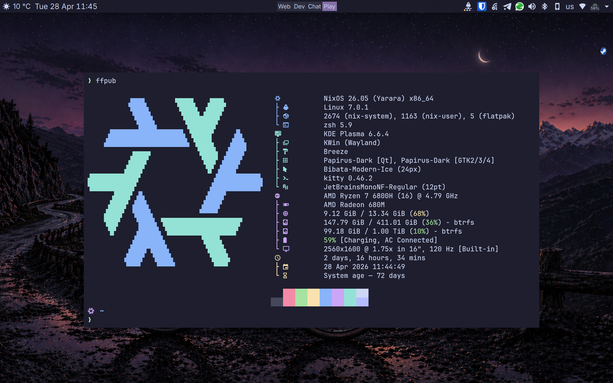
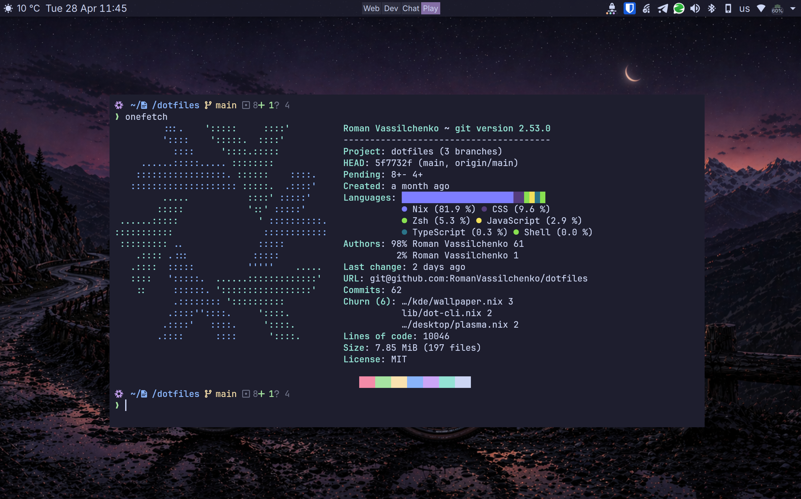

<div align="center">

# NixOS Dotfiles

[](https://nixos.org)
[](https://nixos.wiki/wiki/Flakes)
[](https://kde.org/plasma-desktop/)
[](https://catppuccin.com)




</div>

## Quick Start

```bash
git clone https://github.com/RomanVassilchenko/dotfiles ~/Documents/dotfiles
cd ~/Documents/dotfiles

# Copy and adapt an existing host config
cp -r hosts/laptop-82sn hosts/$(hostname)
sudo nixos-generate-config --show-hardware-config > hosts/$(hostname)/hardware.nix
# Edit hosts/$(hostname)/variables.nix as needed
# Add your host to flake.nix nixosConfigurations

# First build
sudo nixos-rebuild switch --flake .#$(hostname)

# Install dot CLI
sudo ln -sf $PWD/dot.sh /usr/local/bin/dot
```

## Private Directory

`private/` is optional and is not required to build or run this dotfiles setup.
It contains private configuration (work-specific settings, machine-specific overrides), agenix metadata, and encrypted `*.age` secret files.
If you only need the public configuration, you can keep working without `private/`.

## Commands

```bash
# System
dot rebuild              # Rebuild current system
dot rebuild --dry        # Preview changes
dot rebuild-boot         # Rebuild, activate on next boot
dot update               # Update flake inputs and rebuild
dot cleanup              # Trash backup files and GC old generations
dot trim                 # Run fstrim (SSD)
dot doctor               # Health checks

# Server (ninkear — local home server, requires Tailscale)
dot server rebuild       # Pull and rebuild on ninkear
dot server update        # Pull, update flake, and rebuild on ninkear

# Binary cache (via ninkear)
dot cache build          # Build all configs locally
dot cache start          # Start remote build on ninkear (tmux)
dot cache status         # Check remote build progress
```

### rebuild options

```
--dry, -n      Preview what would change
--cores N      Limit to N CPU cores
```

## Configuration

Edit `hosts/<hostname>/variables.nix` to enable apps and set preferences:

```nix
{
  gitUsername = "Your Name";
  keyboardLayout = "us";

  brave    = { enable = true; };
  discord  = { enable = true; };
  telegram = { enable = true; autostart = true; };

  games = {
    heroic        = { enable = true; };
    prismlauncher = { enable = true; };
  };
}
```

### Profiles

| Profile       | Description                   |
| ------------- | ----------------------------- |
| `workstation` | KDE Plasma 6, GUI apps, audio |
| `server`      | Headless, Docker, CLI-only    |

### GPU

Set `gpuProfile` in `flake.nix` to `amd` or `intel`.

## Theming

Catppuccin Mocha system-wide via [Stylix](https://github.com/danth/stylix). Fonts: JetBrains Mono (terminal), Inter (UI). Cursor: Bibata Modern Ice.

---

<p align="center">
  <a href="https://github.com/catppuccin/catppuccin">
    
  </a>
</p>
